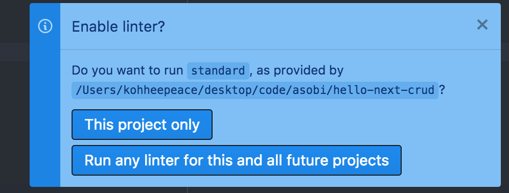

# Add standard for Lint





### Run `standard` command

```text
yarn add -D standard
```

It shows error message

```text
standard
-bash: standard: command not found
```

We need to specify the path

```text
./node_modules/.bin/standard
```


```text
./node_modules/.bin/standard
standard: Use JavaScript Standard Style (https://standardjs.com)
standard: Run `standard --fix` to automatically fix some problems.
  /Users/kohheepeace/Desktop/Code/asobi/hello-next-crud/pages/index.js:4:6: Strings must use singlequote.
```


### [Babel Setting](https://github.com/standard/standard#how-do-i-use-experimental-javascript-es-next-features)



Nextjs uses babel so need to do below

```text
yarn add babel-eslint -D
```

add this to `package.json`:

```text
{
  "standard": {
    "parser": "babel-eslint"
  }
}
```

So...



```text
{
  "name": "hello-next-crud",
  "version": "1.0.0",
  "main": "index.js",
  "license": "MIT",
  "scripts": {
    "dev": "next"
  },
  "standard": {
    "parser": "babel-eslint"
  },
  "dependencies": {
    "next": "^6.1.1",
    "react": "^16.4.2",
    "react-dom": "^16.4.2"
  },
  "devDependencies": {
    "babel-eslint": "^8.2.6",
    "standard": "^11.0.1"
  }
}
```




### Auto Fix

```text
./node_modules/.bin/standard --fix
```


### Atom Setting

> Alternatively, you can install [**linter-js-standard-engine**](https://atom.io/packages/linter-js-standard-engine). Instead of bundling a version of `standard` it will automatically use the version installed in your current project. It will also work out of the box with other linters based on [**standard-engine**](https://github.com/Flet/standard-engine).

=&gt; Install [**linter-js-standard-engine**](https://atom.io/packages/linter-js-standard-engine) ****in Atom.

You may need to restart atom editor




