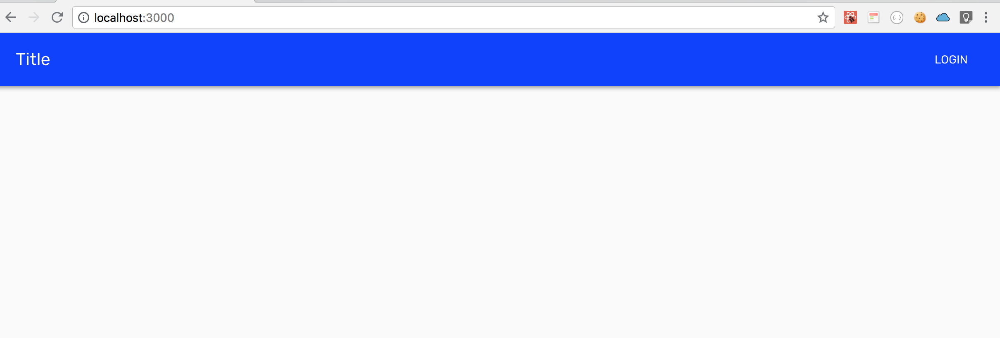
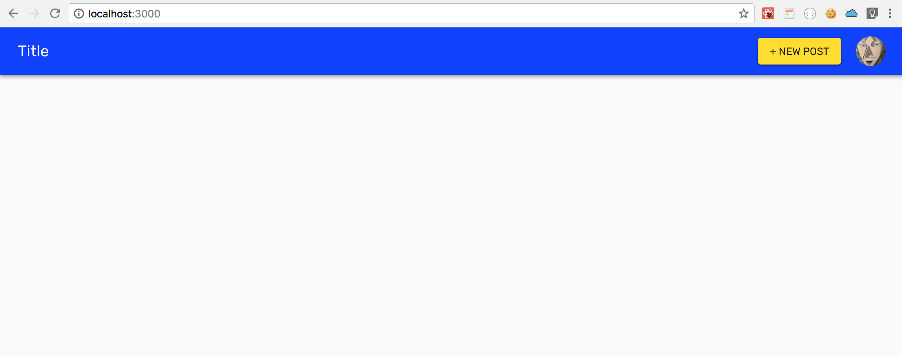

# Chap10 Handle cookie

Use static async [getInitialProps](https://github.com/zeit/next.js/#custom-app) to override initial page props.

```jsx
static async getInitialProps ({ Component, router, ctx }) {
  let pageProps = {}

  const user = Cookie.getJSON('user')
  const expiresAt = Cookie.getJSON('expiresAt')
  const isAuthenticated = Boolean(new Date().getTime() < expiresAt)

  if (Component.getInitialProps) {
    pageProps = await Component.getInitialProps(ctx)
  }

  return {
    pageProps,
    user,
    isAuthenticated
  }
}
```


Pass the `user` and `isAuthenticated` props to

Header and Component.

```jsx
render() {
    const { Component, pageProps, user, isAuthenticated } = this.props
    ...
    return(
    <Header isAuthenticated={isAuthenticated} user={user} />
    <Component pageContext={this.pageContext} {...pageProps} user={user} isAuthenticated={isAuthenticated} />
    ...
    )
}
```




```jsx
import Cookie from 'js-cookie'
```




### final code

```jsx
import React from 'react';
import App, { Container } from 'next/app';
import { MuiThemeProvider } from '@material-ui/core/styles';
import CssBaseline from '@material-ui/core/CssBaseline';
import JssProvider from 'react-jss/lib/JssProvider';
import getPageContext from '../utils/getPageContext';
import Header from '../components/common/Header'
import Cookie from 'js-cookie'

class MyApp extends App {
  static async getInitialProps ({ Component, router, ctx }) {
    let pageProps = {}

    /* Alternatively, call api endpoint '/me' to get current_user */
    const user = Cookie.getJSON('user')
    const expiresAt = Cookie.getJSON('expiresAt')
    const isAuthenticated = Boolean(new Date().getTime() < expiresAt)

    if (Component.getInitialProps) {
      pageProps = await Component.getInitialProps(ctx)
    }

    return {
      pageProps,
      user,
      isAuthenticated
    }
  }

  constructor(props) {
    super(props);
    this.pageContext = getPageContext();
  }

  pageContext = null;

  componentDidMount() {
    // Remove the server-side injected CSS.
    const jssStyles = document.querySelector('#jss-server-side');
    if (jssStyles && jssStyles.parentNode) {
      jssStyles.parentNode.removeChild(jssStyles);
    }
  }

  render() {
    const { Component, pageProps, user, isAuthenticated } = this.props

    return (
      <Container>
        {/* Wrap every page in Jss and Theme providers */}
        <JssProvider
          registry={this.pageContext.sheetsRegistry}
          generateClassName={this.pageContext.generateClassName}
        >
          {/* MuiThemeProvider makes the theme available down the React
              tree thanks to React context. */}
          <MuiThemeProvider
            theme={this.pageContext.theme}
            sheetsManager={this.pageContext.sheetsManager}
          >
            {/* CssBaseline kickstart an elegant, consistent, and simple baseline to build upon. */}
            <CssBaseline />
            {/* Pass pageContext to the _document though the renderPage enhancer
                to render collected styles on server side. */}
            <Header isAuthenticated={isAuthenticated} user={user} />
            <Component pageContext={this.pageContext} {...pageProps} user={user} isAuthenticated={isAuthenticated} />
          </MuiThemeProvider>
        </JssProvider>
      </Container>
    );
  }
}

export default MyApp;
```


### Check!

If you reload page...



If you click "Title"

It worked!!




### In the next chapter

In the next chapter we will check why this happen!

