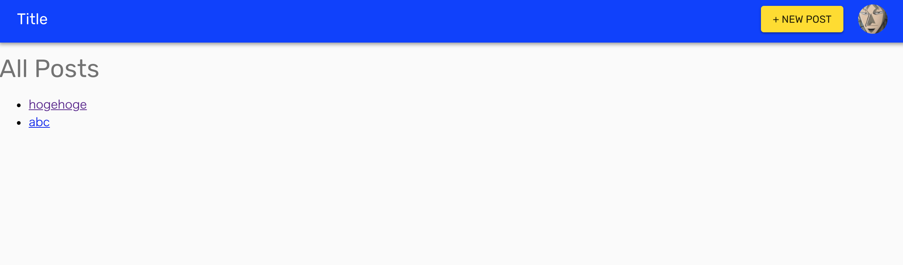
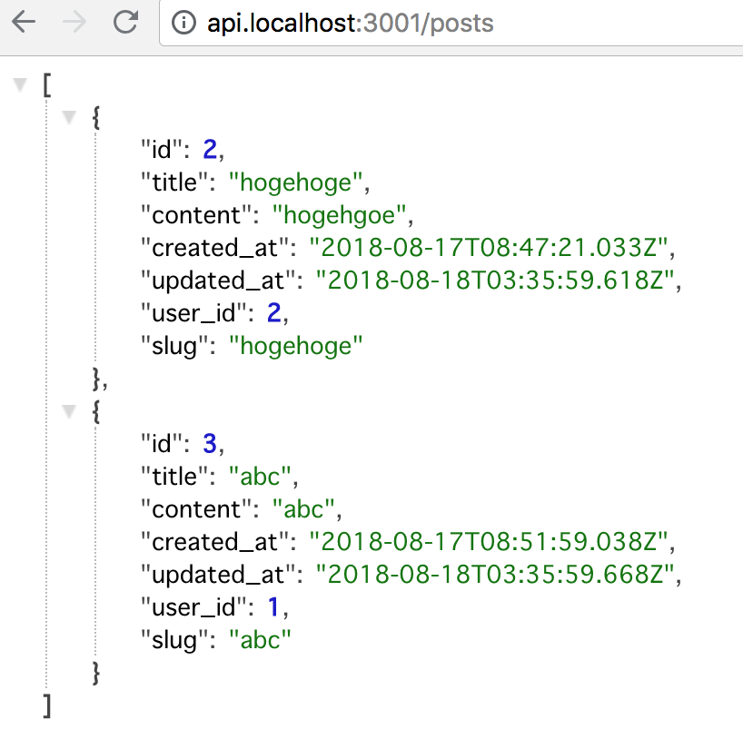
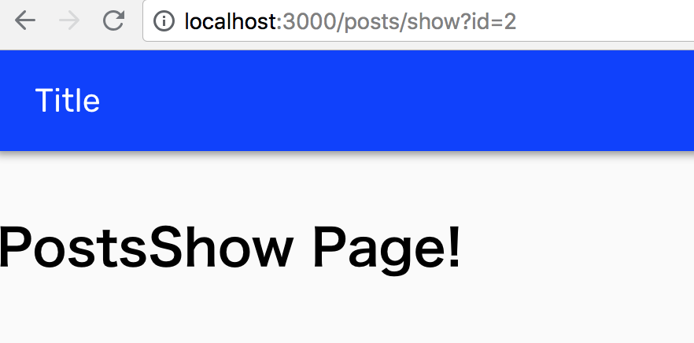

# Chap12 Index page, show all posts




In this chapter, we will show all posts in index page.



```jsx
import Typography from '@material-ui/core/Typography';
import Link from 'next/link'
import axios from 'axios'

const Index = (props) => (
  <div>
    <Typography variant="display1" gutterBottom>All Posts</Typography>
    <ul>
    {props.posts.map((post) => (
      <li key={post.id}>
        <Link href={`/posts/show?id=${post.id}`}>
          <a>{post.title}</a>
        </Link>
      </li>
    ))}
    </ul>
  </div>
)

Index.getInitialProps = async function () {
  const res = await axios.get('http://api.localhost:3001/posts')
  const data = res.data

  return {
    posts: data
  }
}

export default Index
```



This is almost same with[ nextjs learn](https://nextjs.org/learn/basics/fetching-data-for-pages/fetching-batman-shows) example.

Api server endpoint returns below data.




### Next Chapter

In the next chapter, we will implement the custom url with route masking.

Currently show page is not good url.




