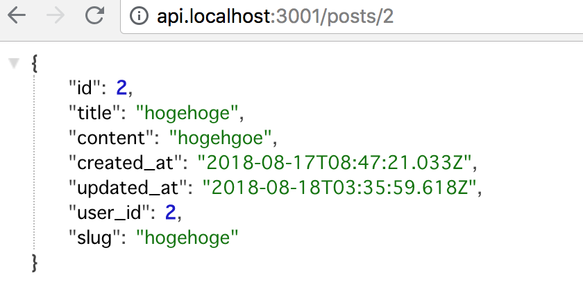

# chap13 Show page Clean URLs with Route Masking

In this chapter, we are doing the same thigns with this.




### Check api response




### Install express

```text
yarn add express
```


### Server.js

Make server.js



```javascript
const express = require('express')
const next = require('next')

const dev = process.env.NODE_ENV !== 'production'
const app = next({ dev })
const handle = app.getRequestHandler()

app.prepare()
  .then(() => {
    const server = express()

    server.get('/posts/:id', (req, res) => {
      const actualPage = '/posts/show'
      const queryParams = { id: req.params.id }
      app.render(req, res, actualPage, queryParams)
    })

    server.get('*', (req, res) => {
      return handle(req, res)
    })

    server.listen(3001, (err) => {
      if (err) throw err
      console.log('> Ready on http://localhost:3001')
    })
  })
  .catch((ex) => {
    console.error(ex.stack)
    process.exit(1)
  })
```




### Edit package.json scripts

```text
"scripts": {
    "dev": "node server.js"
}
```

so...



```javascript
{
  "name": "hello-next-crud",
  "version": "1.0.0",
  "main": "index.js",
  "license": "MIT",
  "scripts": {
    "dev": "node server.js"
  },
  "dependencies": {
    "@material-ui/core": "^1.5.0",
    "axios": "^0.18.0",
    "express": "^4.16.3",
    "js-cookie": "^2.2.0",
    "next": "^6.1.1",
    "react": "^16.4.2",
    "react-dom": "^16.4.2",
    "react-google-login": "^3.2.1"
  }
}
```




### Edit `posts/show.js`



```jsx
import axios from 'axios'
import Typography from '@material-ui/core/Typography'

const PostsShow = (props) => (
  <div>
    <Typography variant='display1' gutterBottom>{props.data.title}</Typography>
    <Typography>{props.data.content}</Typography>
  </div>
)

PostsShow.getInitialProps = async function (context) {
  const { id } = context.query
  const res = await axios.get(`http://api.localhost:3001/posts/${id}`)
  const data = res.data

  return { data }
}

export default PostsShow
```




### Edit `pages/index.js` Link

```jsx
<Link prefetch as={`/posts/${post.slug}`} href={`/posts/show?id=${post.id}`}>
```



```jsx
import Typography from '@material-ui/core/Typography';
import Link from 'next/link'
import axios from 'axios'

const Index = (props) => (
  <div>
    <Typography variant="display1" gutterBottom>All Posts</Typography>
    <ul>
    {props.posts.map((post) => (
      <li key={post.id}>
        <Link prefetch as={`/posts/${post.slug}`} href={`/posts/show?id=${post.id}`}>
          <a>{post.title}</a>
        </Link>
      </li>
    ))}
    </ul>
  </div>
)

Index.getInitialProps = async function () {
  const res = await axios.get('http://api.localhost:3001/posts')
  const data = res.data

  return {
    posts: data
  }
}

export default Index
```



Note about Link [prefetch](https://github.com/zeit/next.js#prefetching-pages)


### Check

It worked! Both client and server reload.

**But...**

**If you visit** 

[http://localhost:3000/posts/new](http://localhost:3000/posts/new)

It doesn't work.

This is because, Server try to fetch post which `id` is "new".


### Edit `server.js` 

Add this to render exactly posts/new page

```jsx
server.get('/posts/new', (req, res) => {
    // app.render(req, res, actualPage, queryParams)
    app.render(req, res, '/posts/new')
})
```

if url is '/posts/new', render actualPage '/posts/new'.

So...



```javascript
const express = require('express')
const next = require('next')

const dev = process.env.NODE_ENV !== 'production'
const app = next({ dev })
const handle = app.getRequestHandler()

app.prepare()
  .then(() => {
    const server = express()

    server.get('/posts/new', (req, res) => {
      app.render(req, res, '/posts/new')
    })

    server.get('/posts/:id', (req, res) => {
      const actualPage = '/posts/show'
      const queryParams = { id: req.params.id }
      app.render(req, res, actualPage, queryParams)
    })

    server.get('*', (req, res) => {
      return handle(req, res)
    })

    server.listen(3000, (err) => {
      if (err) throw err
      console.log('> Ready on http://localhost:3000')
    })
  })
  .catch((ex) => {
    console.error(ex.stack)
    process.exit(1)
  })
```




### Check

Restart sever and visit posts/new


It worked!


Backend needs to reserve like `new`, `edit` [https://github.com/norman/friendly\_id/blob/9cd4ce2b5d0425aa704872e1334b442cab03c29c/test/reserved\_test.rb](https://github.com/norman/friendly_id/blob/9cd4ce2b5d0425aa704872e1334b442cab03c29c/test/reserved_test.rb)


