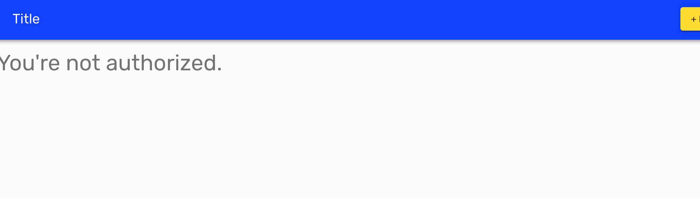

# Chap18 posts\#edit

In this chapter, we will create posts\#edit page

* [ ] get post id from url, then fetch post data from server and set post data \(title, content\) in state.
* [ ] Only the post owner can edit post.


This is complete `posts/edit.js` 



```jsx
import React from 'react'
import Typography from '@material-ui/core/Typography'
import TextField from '@material-ui/core/TextField'
import Button from '@material-ui/core/Button'
import Paper from '@material-ui/core/Paper'
import { withStyles } from '@material-ui/core/styles'
import Router from 'next/router'
import axios from '../../utils/customAxios'
import CircularProgress from '@material-ui/core/CircularProgress'
import { addMessage } from '../../components/common/Notifier'
import NotAuthenticated from '../../components/common/NotAuthenticated'
import NotAuthorized from '../../components/common/NotAuthorized'

const styles = {
  root: {
    textAlign: 'center',
    paddingTop: '3rem'
  },
  paper: {
    padding: '20px 40px',
    maxWidth: 480,
    margin: '0 auto'
  }
}

class PostsEdit extends React.Component {
  static async getInitialProps (ctx) {
    const { id } = ctx.query
    const res = await axios.get(`/posts/${id}`)
    const data = res.data

    return { post: data }
  }

  constructor (props) {
    super(props)
    const { post } = props
    const { title, content } = post
    this.state = {
      title,
      content,
      isLoading: false
    }
  }

  handleInputChange = name => event => {
    this.setState({
      [name]: event.target.value
    })
  };

  handleSubmit = (event) => {
    event.preventDefault()
    this.setState({ isLoading: true })

    const { post } = this.props
    const { title, content } = this.state

    axios({
      method: 'put',
      url: `/posts/${post.id}`,
      data: {post: { title, content }}
    })
      .then((res) => {
        this.setState({
          isLoading: false
        })
        addMessage('Successfully Updated Post!')
        const { data } = res
        const { id, slug } = data

        /* Router.push(url, as) */
        Router.push(`/posts/show?id=${id}`, `/posts/${slug}`)
      })
      .catch((error) => {
        console.log(error)

        this.setState({
          isLoading: false
        })
        addMessage('Something wrong happened!')
      })
  }

  render () {
    const { classes, isAuthenticated, user, post } = this.props
    const { title, content, isLoading } = this.state

    if (!isAuthenticated) {
      return <NotAuthenticated />
    } else if (post.user_id !== user.id) {
      return <NotAuthorized />
    } else {
      return (
        <div className={classes.root}>
          <Typography variant='display1' gutterBottom>Edit Post</Typography>
          <Paper className={classes.paper}>
            <form className='form' onSubmit={this.handleSubmit}>
              <TextField
                id='title'
                label='Title'
                value={title}
                onChange={this.handleInputChange('title')}
                margin='normal'
                fullWidth
              />
              <TextField
                id='content'
                label='Content'
                value={content}
                onChange={this.handleInputChange('content')}
                margin='normal'
                fullWidth
                multiline
                rows='7'
              />
              <Button
                variant='raised'
                type='submit'
                color='secondary'
                fullWidth
                disabled={isLoading}
                style={{marginTop: 20}}
              >
                {isLoading ? <CircularProgress size={24} /> : 'Update'}
              </Button>
            </form>
          </Paper>
        </div>
      )
    }
  }
}
export default withStyles(styles)(PostsEdit)
```




### Make NotAuthorized components

In `posts/edit.js` page, only post owner can see the post edit form.

```jsx
if (!isAuthenticated) {
  return <NotAuthenticated />
} else if (post.user_id !== user.id) {
  return <NotAuthorized />
} else {
  return ( /* post form here */ )
}
```




```jsx
import Typography from '@material-ui/core/Typography'

export default () => (
  <div>
    <Typography variant='display1' gutterBottom>
      {"You're not authorized."}
    </Typography>
  </div>
)
```




### Add custom server url posts/:slug/edit



```javascript
server.get('/posts/:id/edit', (req, res) => {
    const actualPage = '/posts/edit'
    const queryParams = { id: req.params.id }
    app.render(req, res, actualPage, queryParams)
})
```



Entire code...



```javascript
const express = require('express')
const next = require('next')

const dev = process.env.NODE_ENV !== 'production'
const app = next({ dev })
const handle = app.getRequestHandler()

app.prepare()
  .then(() => {
    const server = express()

    server.get('/posts/:id/edit', (req, res) => {
      const actualPage = '/posts/edit'
      const queryParams = { id: req.params.id }
      app.render(req, res, actualPage, queryParams)
    })

    server.get('/posts/new', (req, res) => {
      app.render(req, res, '/posts/new')
    })

    server.get('/posts/:id', (req, res) => {
      const actualPage = '/posts/show'
      const queryParams = { id: req.params.id }
      app.render(req, res, actualPage, queryParams)
    })

    server.get('*', (req, res) => {
      return handle(req, res)
    })

    server.listen(3000, (err) => {
      if (err) throw err
      console.log('> Ready on http://localhost:3000')
    })
  })
  .catch((ex) => {
    console.error(ex.stack)
    process.exit(1)
  })
```




### Check it

Login from others and make post. then visit

[http://localhost:3000/posts/:slug/edit](http://localhost:3000/posts/hogehoge/edit)



It worked!

