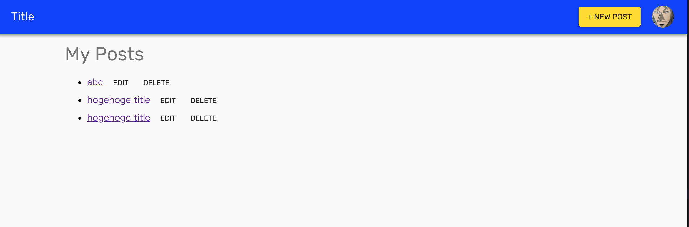

# Chap19 posts\#index



```jsx
import Typography from '@material-ui/core/Typography'
import Grid from '@material-ui/core/Grid'
import Button from '@material-ui/core/Button'
import Link from 'next/link'
import React from 'react'
import axios from '../../utils/customAxios'
import { addMessage } from '../../components/common/Notifier'
import NotAuthenticated from '../../components/common/NotAuthenticated'

class PostsIndex extends React.Component {
  constructor (props) {
    super(props)
    this.state = {
      posts: []
    }
  }

  // https://github.com/zeit/next.js/issues/2869
  /* If you want to disable SSR */
  componentDidMount () {
    axios.get('user/posts')
      .then((res) => {
        this.setState({
          posts: res.data
        })
      })
      .catch((error) => {
        console.log(error)
      })
  }

  handleDeletePost = (deletePost) => {
    axios.delete(`/posts/${deletePost.id}`)
      .then(() => {
        addMessage('delete Post!')
        // return posts expect delete item
        const posts = this.state.posts.filter(post => post.id !== deletePost.id)
        this.setState({posts})
      })
  }

  render () {
    const { posts } = this.state
    const { isAuthenticated } = this.props
    if (!isAuthenticated) {
      return <NotAuthenticated />
    }
    return (
      <div style={{ padding: '0 20px' }}>
        <Grid container justify='center' spacing={8}>
          <Grid item md={10} xs={12}>
            <Typography variant='display1' gutterBottom>My Posts</Typography>
            <ul>
              {posts.map((post) => (
                <li key={post.id}>
                  <Link prefetch as={`/posts/${post.slug}`} href={`/posts/show?id=${post.id}`}>
                    <a className='post-title'>{post.title}</a>
                  </Link>
                  <Link as={`/posts/${post.slug}/edit`} href={`/posts/edit?id=${post.id}`}>
                    <Button size='small'>Edit</Button>
                  </Link>
                  <Button size='small' onClick={() => this.handleDeletePost(post)}>
                    Delete
                  </Button>
                </li>
              ))}
            </ul>
          </Grid>
        </Grid>
      </div>
    )
  }
}

export default PostsIndex
```




In this page

1. Show my posts.
2. Each post has Link to show and edit page.
3. Each post has delete action button.


We fetch posts in componentDidMount.

You can use getInitialProps also, but this is dashboard page so, SEO is not need. **But...  just depends on you!**

\*\*\*\*




