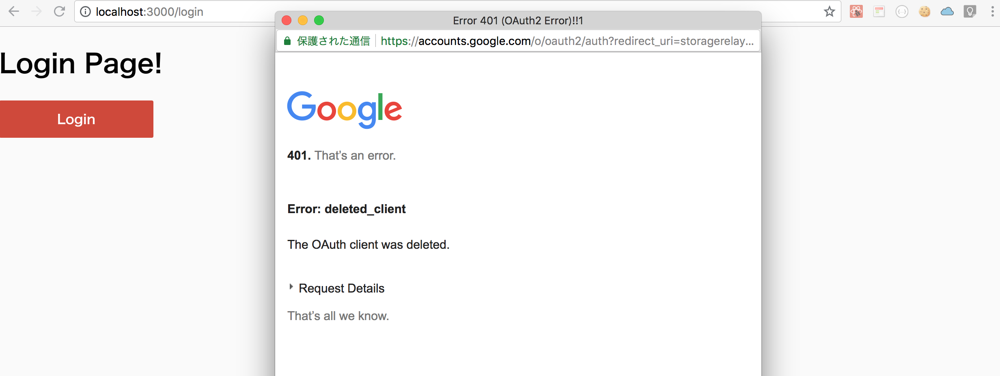
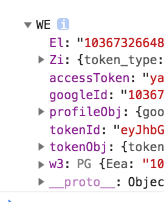
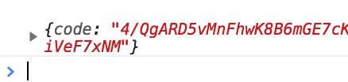

# Chap5 Login Page and Google Sign-in Button

In Google Official Docs, they introduce how to Add Google Button,

**But it is pure javascript.**

To work with React seamlessly, We will use this npm package.



Okay, Let's Start!


```text
yarn add react-google-login
```




```jsx
import { GoogleLogin } from 'react-google-login';

const responseGoogle = (response) => {
  console.log(response);
}

const Login = () => (
  <div>
    <h1>Login Page!</h1>
    <GoogleLogin
      clientId="658977310896-knrl3gka66fldh83dao2rhgbblmd4un9.apps.googleusercontent.com"
      buttonText="Login"
      onSuccess={responseGoogle}
      onFailure={responseGoogle}
    />
  </div>
)

export default Login
```






To open google form correctly, you need to set `clientId` correctly. Check the below url.




### Check the console.log response




There is another way to send `tokenId` to server 




**But...**

We the flow we use it this 




**So... we just need `one-time code`**


```text
responseType='code'
```


### And this is the flow when user is offline

[https://developers.google.com/identity/sign-in/web/server-side-flow\#step\_4\_add\_the\_sign-in\_button\_to\_your\_page](https://developers.google.com/identity/sign-in/web/server-side-flow#step_4_add_the_sign-in_button_to_your_page)

```text
accessType='offline'
```

About 'offline' meaning [https://stackoverflow.com/questions/30637984/what-does-offline-access-in-oauth-mean](https://stackoverflow.com/questions/30637984/what-does-offline-access-in-oauth-mean)




```jsx
import { GoogleLogin } from 'react-google-login';

const responseGoogle = (response) => {
  console.log(response);
}

const Login = () => (
  <div>
    <h1>Login Page!</h1>
    <GoogleLogin
      clientId="599452345899-rbpa86it53ba6pr6jtgsimbhpddkvdka.apps.googleusercontent.com"
      buttonText="Login"
      accessType='offline'
      responseType='code'
      onSuccess={responseGoogle}
      onFailure={responseGoogle}
    />
  </div>
)

export default Login
```



### Check the response again 




### Next chapter

In the next chapter, we will send the `one-time` code to server and set accessToken return from server. This is 4\) flow in fig \(★） 


