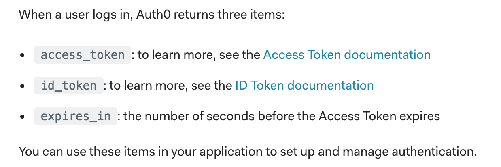

# Chap6 Send one-time code and setToken


In this chapter, we will send one-time code to server.


### Install Axios

To use axios to send request to server. 

Nextjs uses [isomorphic-unfetch](https://github.com/developit/unfetch/tree/master/packages/isomorphic-unfetch)

But you can do almost same things with axios.




```text
yarn add axios
```


### Edit responseGoogle function

```javascript
import { GoogleLogin } from 'react-google-login';
import Router from 'next/router'

const responseGoogle = (response) => {
  axios({
    baseURL: 'http://api.localhost:3001/',
    method: 'post',
    url: '/auth/google_oauth2/callback',
    params: {code: response.code},
    headers: {'X-Requested-With': 'XMLHttpRequest'}
  })
    .then((res) => {
      const { data } = res
      const { user, accessToken, expiresAt } = data
      // setToken(user, accessToken, expiresAt)
      Router.push('/')
      // addMessage('Successfully Login')
    })
    .catch((error) => {
      console.log(error)
    })
}
```


As documented in [google official docs](https://developers.google.com/identity/sign-in/web/server-side-flow#step_6_send_the_authorization_code_to_the_server), we need to add below headers.

> ```text
> // Always include an `X-Requested-With` header in every AJAX request,
> // to protect against CSRF attacks.
> headers: {
>   'X-Requested-With': 'XMLHttpRequest'
> },
> ```

### After successfully requests

We don't deep dive into server, After successful google-login server returns the response data.

1. user
2. expiresAt
3. accessToken

I referenced  [https://auth0.com/docs/quickstart/spa/react/01-login](https://auth0.com/docs/quickstart/spa/react/01-login).

Auth0 returns

1. id\_token =&gt; includes user info
2. access\_token
3. expires\_in



After successfully sign in, what we need to do is...

```text
// setToken(user, accessToken, expiresAt)
Router.push('/')
```

Router.push is nextjs helper function. Redirect to '/' path.

`setToken` function will be  explained next chapter. 

