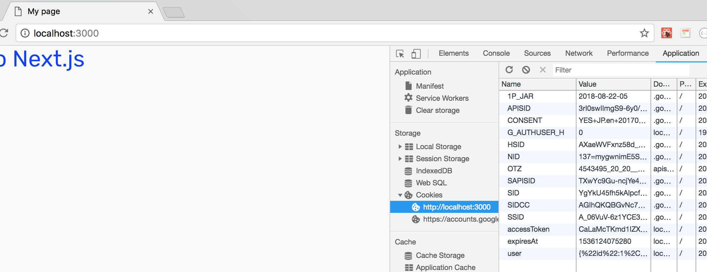

# chap7 SetToken, js-cookie

### Overview 

We will implement the `setToken` in `pages/login.js`



```jsx
import { setToken } from '../utils/auth'

```




### js-cookie

We store sensible info in cookie. To easily store and retrieve cookie we use...



js-cookie is also used in this repo.



```text
yarn add js-cookie
```


### utils/auth.js

Make `utils/auth.js` this file includes functions related to authentication.



```javascript
export const setToken = (user, accessToken, expiresAt) => {
  if (!process.browser) {
    return
  }

  /* expiresAt argument is 'string' of ISO date time */
  // https://www.w3schools.com/js/js_date_formats.asp
  // console.log(expiresAt) => 2018-08-28T17:35:43.025Z

  // https://github.com/js-cookie/js-cookie#expires
  // Default, Cookies automatically vanish when Browser Tab is closed
  // So... Set Cookie with expires to remain user log-in.
  // 'expires' is Number or Date object
  // convert string to Date object
  const expiresDate = new Date(expiresAt)

  Cookie.set('user', user, { expires: expiresDate })
  Cookie.set('accessToken', accessToken, { expires: expiresDate })
  Cookie.set('expiresAt', Date.parse(expiresAt), { expires: expiresDate })
}
```



setToken function receives `user`, `accessToken` and `expiresAt`.

Then, setting these arguments in Cookie after formatting expiresAt.

expiresAt is datetime format in activerecord of ruby on rails, and returned by rails `render json` method.

So, this is might be different of the backend language.


### Cookie Expiration

> Define when the cookie will be removed. Value can be a [`Number`](https://developer.mozilla.org/en-US/docs/Web/JavaScript/Reference/Global_Objects/Number) which will be interpreted as days from time of creation or a [`Date`](https://developer.mozilla.org/en-US/docs/Web/JavaScript/Reference/Global_Objects/Date) instance. If omitted, the cookie becomes a session cookie.
>
> To create a cookie that expires in less than a day, you can check the [FAQ on the Wiki](https://github.com/js-cookie/js-cookie/wiki/Frequently-Asked-Questions#expire-cookies-in-less-than-a-day).
>
> **Default:** Cookie is removed when the user closes the browser.




### Edit login.js



```jsx
import { GoogleLogin } from 'react-google-login';
import Router from 'next/router'
import axios from 'axios'
import { setToken } from '../utils/auth'

const responseGoogle = (response) => {
  axios({
    baseURL: 'http://api.localhost:3001/',
    method: 'post',
    url: '/auth/google_oauth2/callback',
    params: {code: response.code},
    headers: {'X-Requested-With': 'XMLHttpRequest'}
  })
    .then((res) => {
      const { data } = res
      const { user, accessToken, expiresAt } = data
      setToken(user, accessToken, expiresAt)
      Router.push('/')
    })
    .catch((error) => {
      console.log(error)
    })
}

const Login = () => (
  <div>
    <h1>Login Page!</h1>
    <GoogleLogin
      clientId="599452345899-rbpa86it53ba6pr6jtgsimbhpddkvdka.apps.googleusercontent.com"
      buttonText="Login"
      accessType='offline'
      responseType='code'
      onSuccess={responseGoogle}
      onFailure={responseGoogle}
    />
  </div>
)

export default Login
```




### Check Cookie

Check the cookie in chrome browser dev tools.




### We can store sensible info in cookie!

