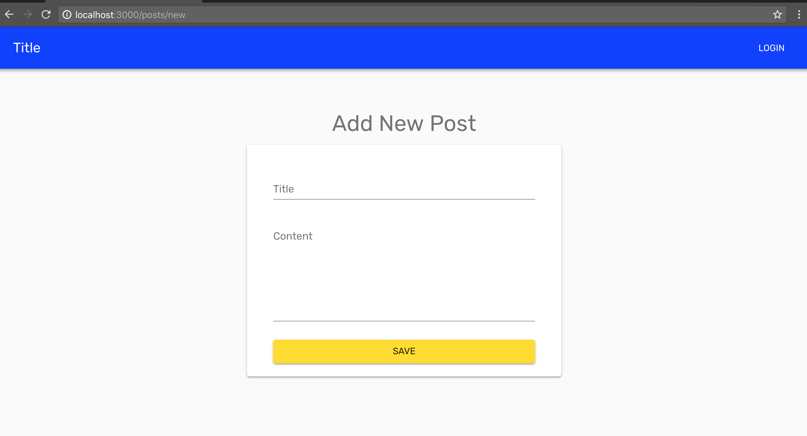
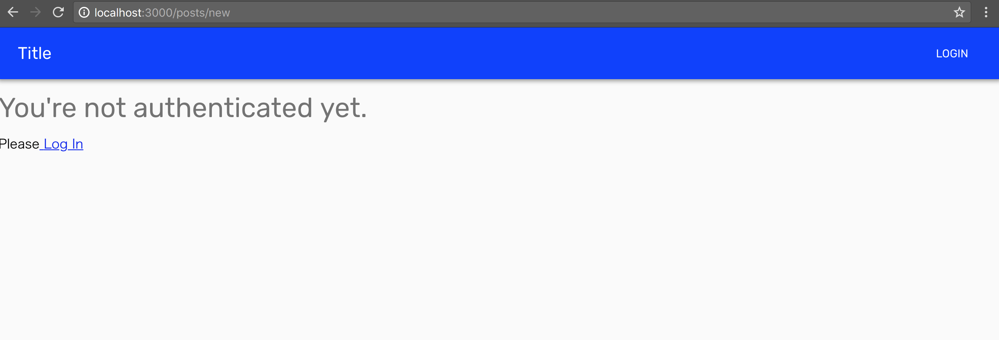

# Chap16 NotAuthenticated.js

In this chapter, we will make NotAuthenticated.js component.

### Check Current behavior

You can see `posts/new` page without login.




To avoid this...

Return `NotAuthenticated` component when user is not authenticated. 

```jsx
render () {
    const { classes, isAuthenticated } = this.props
    const { title, content, isLoading } = this.state
    if (!isAuthenticated) {
      return <NotAuthenticated />
    }
    ...
  }
```

Please Uncomment these code



```jsx
if (!isAuthenticated) {
  return <NotAuthenticated />
}
```




Let's make the component!



```jsx
import Typography from '@material-ui/core/Typography'
import Link from 'next/link'

export default () => (
  <div className='root'>
    <Typography variant='display1' gutterBottom>
      {"You're not authenticated yet."}
    </Typography>
    <div>
      Please
      <Link href='/login'>
        <a>{`  `}Log In</a>
      </Link>
    </div>
  </div>
)
```




And Import it



```jsx
import NotAuthenticated from '../../components/common/NotAuthenticated'
```




### Check

It worked!




