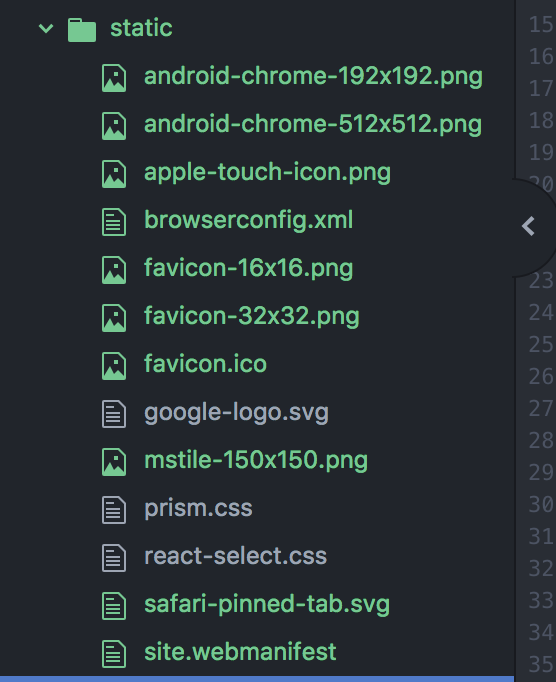

# Favicon, Splash Image, Robots.txt ... etc

### Favicon, Splash Image

### Make Logo in sketch or somewhere...

After that, make favicon and splash image etc in 



After that dowload generated file.

And move it to nextjs **static** folder.





