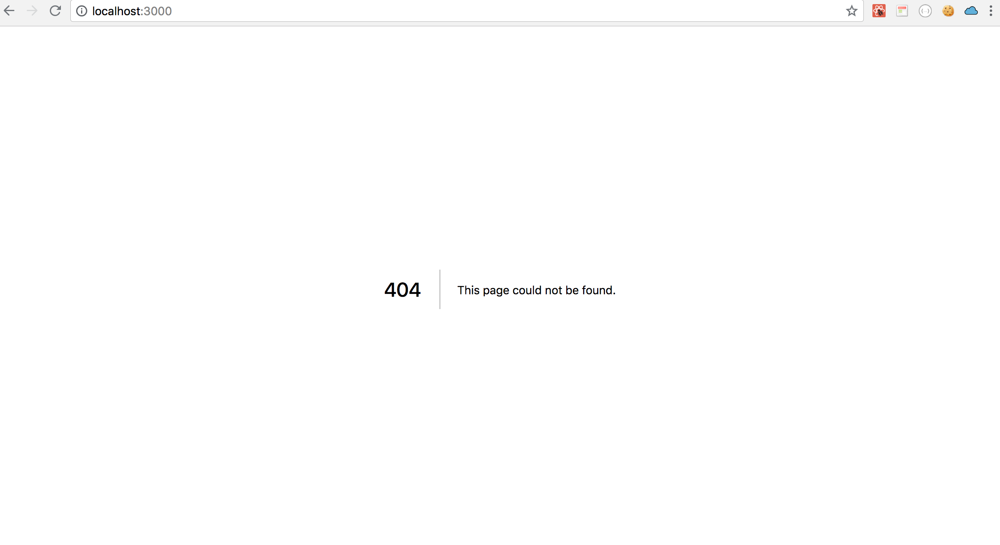
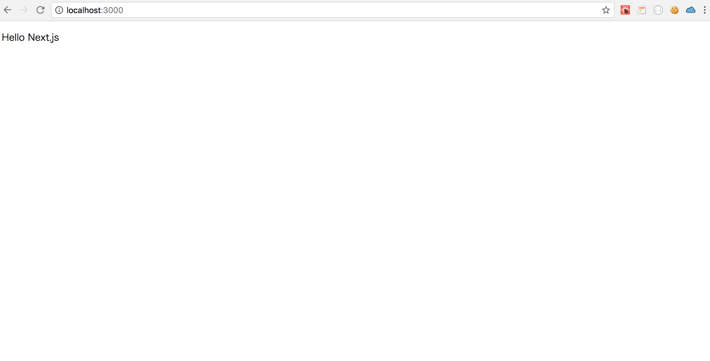

# Chap1 Nextjs Setup




```text
mkdir hello-next-crud
cd hello-next-crud
yarn init -y
yarn add react react-dom next
mkdir pages
```


```text
touch .gitignore
```


```text
node_modules
.next
yarn-error.log
```


[https://github.com/luisrudge/next.js-boilerplate/blob/master/.gitignore](https://github.com/luisrudge/next.js-boilerplate/blob/master/.gitignore)

[https://stackoverflow.com/questions/42592168/should-i-add-yarn-error-log-to-my-gitignore-file](https://stackoverflow.com/questions/42592168/should-i-add-yarn-error-log-to-my-gitignore-file)


```text
git init
```


Add NPM script.

```text
{
  "scripts": {
    "dev": "next"
  }
}
```




```javascript
{
  "name": "hello-next-crud",
  "version": "1.0.0",
  "main": "index.js",
  "license": "MIT",
  "scripts": {
    "dev": "next"
  },
  "dependencies": {
    "next": "^6.1.1",
    "react": "^16.4.2",
    "react-dom": "^16.4.2"
  }
}
```




```text
yarn run dev
```


Visit

[http://localhost:3000/](http://localhost:3000/)





Create a file named `pages/index.js` and add the following content:  




```javascript
const Index = () => (
  <div>
    <p>Hello Next.js</p>
  </div>
)

export default Index
```




Now if you visit [http://localhost:3000](http://localhost:3000/) again, you'll see a page with "Hello Next.js"  





