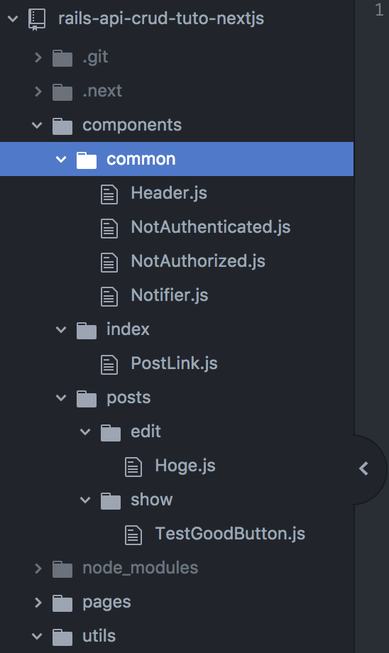

# Chap8 Index Page Overview and Folder Strcture

### Overview of index page

### Folder Structure

Not like Ruby on Rails, **there is no rule** about structure in react.

But... I usually think about filename...folder structure etc...

So, I construct folder like rails.

### **One Page, One Folder** 

If you want to share components, use `common` folder.

Maybe, there will be waste of code, but I think it is tradeoff for thinking time.

