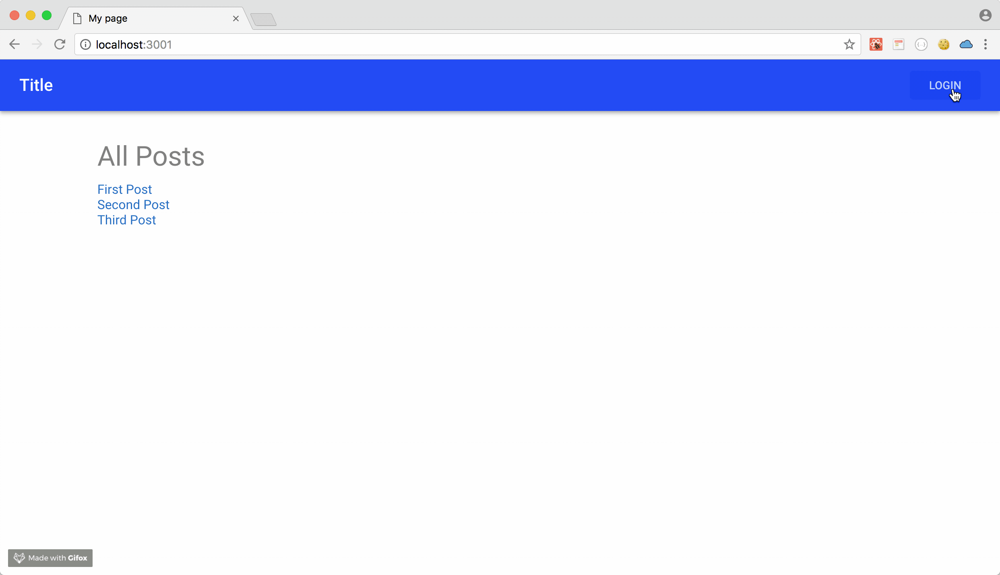

# Chap4 Login Flow Overview

### Overview of Login flow

### Understand simple Token Authentication Flow

### Check SPA Login Flow in this App

1. Use [Google Login](https://developers.google.com/identity/sign-in/web/server-side-flow) 
2. Backend Server return AccessToken to Client
3. Store the AccessToken in Client

### Question you might think

1. Where to store AccessToken ?
2. How to change the client view if user logged in ?

### Where to store AccessToken in Client ?

In react Application, auth0 team shows to store AccessToken in **localStorage**

{% embed data="{\"url\":\"https://auth0.com/docs/quickstart/spa/react/01-login\",\"type\":\"link\",\"title\":\"Auth0 React SDK Quickstarts: Login\",\"description\":\"This tutorial demonstrates how to add user login to a React application using Auth0.\",\"icon\":{\"type\":\"icon\",\"url\":\"https://cdn2.auth0.com/styleguide/latest/lib/logos/img/favicon.png\",\"aspectRatio\":0},\"thumbnail\":{\"type\":\"thumbnail\",\"url\":\"https://cdn2.auth0.com/docs/media/social-media/fb-card.png\",\"width\":1200,\"height\":630,\"aspectRatio\":0.525}}" %}

**But...** 

Page is Server Side Rendering in Nextjs App, So to store localStorage [is not working well](https://github.com/luisrudge/next.js-auth0/issues/10).

**So...**

Use **Cookie** to store AccessToken

{% embed data="{\"url\":\"https://github.com/zeit/next.js/issues/153\",\"type\":\"link\",\"title\":\"Add login / authentication example · Issue \#153 · zeit/next.js\",\"description\":\"With: re-usable authentication helper across pages session synchronization among tabs simple passwordless email backend hosted on now.sh I think this will be hugely helpful to a lot of newcomers.\",\"icon\":{\"type\":\"icon\",\"url\":\"https://github.com/fluidicon.png\",\"aspectRatio\":0},\"thumbnail\":{\"type\":\"thumbnail\",\"url\":\"https://avatars3.githubusercontent.com/u/13041?s=400&v=4\",\"width\":250,\"height\":250,\"aspectRatio\":1}}" %}



### How to change the client view if user logged in ?

We will learn this in the later chapter !!

