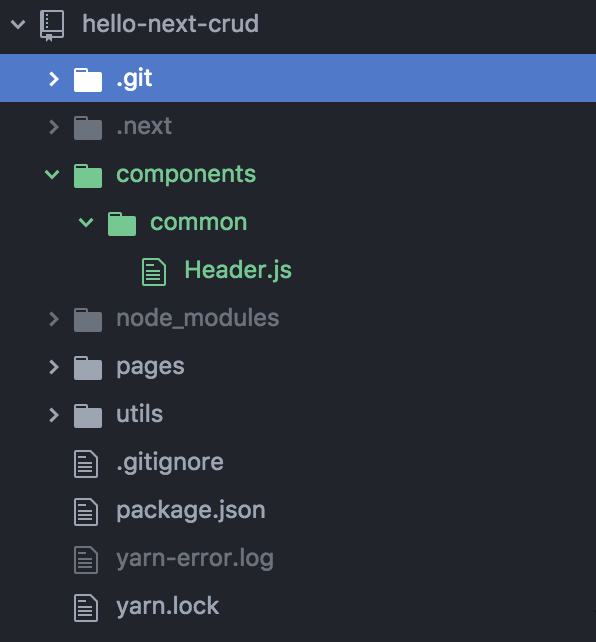
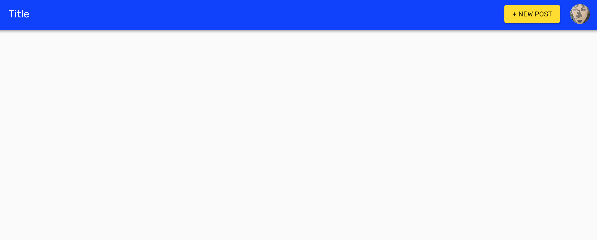
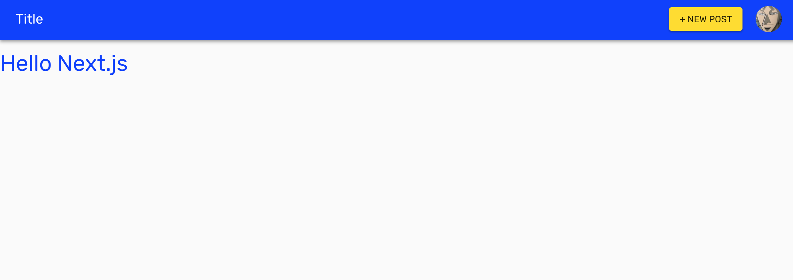

# Chap9 Make Header

###  Make Header.js

Okay, so let's make `Header.js`




### Ideal Header

Change the view by the condition of `isAuthenticated`.

And we want to show the `user` avatar.



```jsx
import React from 'react'
import AppBar from '@material-ui/core/AppBar'
import Toolbar from '@material-ui/core/Toolbar'

class Header extends React.Component {
  render () {
    // It is useful if these props is passed like this
    const {user, isAuthenticated} = this.props

    return (
      <AppBar position='fixed'>
        {isAuthenticated
          ? (
            <Toolbar>
              // Title
              // New Post Button
              // User Avatar => 
            </Toolbar>
          )
          : (
            <Toolbar>
              // Title
              // Login Link Button
            </Toolbar>
          )
        }
      </AppBar>
    )
  }
}

export default Header
```




### Final Header.js



```jsx
import React from 'react'
import Link from 'next/link'
import { withStyles } from '@material-ui/core/styles'
import AppBar from '@material-ui/core/AppBar'
import Toolbar from '@material-ui/core/Toolbar'
import Typography from '@material-ui/core/Typography'
import Button from '@material-ui/core/Button'
import Avatar from '@material-ui/core/Avatar'
import Menu from '@material-ui/core/Menu'
import MenuItem from '@material-ui/core/MenuItem'

const styles = {
  flex: {
    flex: 1
  }
}

class Header extends React.Component {
  state = {
    anchorEl: null
  };

  handleMenu = event => {
    this.setState({ anchorEl: event.currentTarget })
  };

  handleCloseMenu = () => {
    this.setState({ anchorEl: null })
  };

  render () {
    const {user, isAuthenticated, classes} = this.props
    const {anchorEl} = this.state

    const open = Boolean(anchorEl)

    return (
      <AppBar position='fixed'>
        {isAuthenticated
          ? (
            <Toolbar>
              <Link prefetch href='/'>
                <Typography style={{cursor: 'pointer'}} variant='title' color='inherit' className={classes.flex}>
                  Title
                </Typography>
              </Link>
              <Link prefetch href='/posts/new'>
                <Button variant='raised' color='secondary' style={{marginRight: 20}}>
                  + New Post
                </Button>
              </Link>
              <Avatar
                alt='avatar'
                src={user.image || 'https://avatars2.githubusercontent.com/u/29557494'}
                aria-owns={open ? 'menu-appbar' : null}
                aria-haspopup='true'
                onClick={this.handleMenu}
              />
              <Menu
                id='menu-appbar'
                anchorEl={anchorEl}
                getContentAnchorEl={null}
                anchorOrigin={{
                  vertical: 'bottom',
                  horizontal: 'left'
                }}
                transformOrigin={{
                  vertical: 'top',
                  horizontal: 'center'
                }}
                open={open}
                onClose={this.handleCloseMenu}
              >
                <MenuItem onClick={this.handleCloseMenu}>
                  <Link prefetch href='/posts'>
                    <a>My Posts</a>
                  </Link>
                </MenuItem>
              </Menu>
            </Toolbar>
          )
          : (
            <Toolbar>
              <Link prefetch href='/'>
                <Typography style={{cursor: 'pointer'}} variant='title' color='inherit' className={classes.flex}>
                  Title
                </Typography>
              </Link>
              <Link prefetch href='/login'>
                <Button color='inherit'>Login</Button>
              </Link>
            </Toolbar>
          )
        }
      </AppBar>
    )
  }
}

export default withStyles(styles)(Header)
```



This is almost same with [material-ui-example](https://material-ui.com/demos/app-bar/#app-bar-with-menu).


### Include `Header.js` in `pages/_app.js`

{% embed data="{\"url\":\"https://github.com/zeit/next.js/blob/25de2e814ecda011d4d99386f6c95be0efb3cdf1/readme.md\#custom-app\",\"type\":\"link\",\"title\":\"zeit/next.js\",\"description\":\"next.js - Next.js is a lightweight framework for static and server‑rendered applications.\",\"icon\":{\"type\":\"icon\",\"url\":\"https://github.com/fluidicon.png\",\"aspectRatio\":0},\"thumbnail\":{\"type\":\"thumbnail\",\"url\":\"https://avatars3.githubusercontent.com/u/14985020?s=400&v=4\",\"width\":400,\"height\":400,\"aspectRatio\":1}}" %}

In nextjs document, it shows use `_app.js` as Layout.

So In `_app.js` 

Import `Header.js`

```text
import Header from '../components/common/Header'
```

And render it with dummy **props**

```text
<Header isAuthenticated={false} user={{}} />
```

So the entire code looks...



```jsx
import React from 'react';
import App, { Container } from 'next/app';
import { MuiThemeProvider } from '@material-ui/core/styles';
import CssBaseline from '@material-ui/core/CssBaseline';
import JssProvider from 'react-jss/lib/JssProvider';
import getPageContext from '../utils/getPageContext';
import Header from '../components/common/Header'

class MyApp extends App {
  constructor(props) {
    super(props);
    this.pageContext = getPageContext();
  }

  pageContext = null;

  componentDidMount() {
    // Remove the server-side injected CSS.
    const jssStyles = document.querySelector('#jss-server-side');
    if (jssStyles && jssStyles.parentNode) {
      jssStyles.parentNode.removeChild(jssStyles);
    }
  }

  render() {
    const { Component, pageProps } = this.props;
    return (
      <Container>
        {/* Wrap every page in Jss and Theme providers */}
        <JssProvider
          registry={this.pageContext.sheetsRegistry}
          generateClassName={this.pageContext.generateClassName}
        >
          {/* MuiThemeProvider makes the theme available down the React
              tree thanks to React context. */}
          <MuiThemeProvider
            theme={this.pageContext.theme}
            sheetsManager={this.pageContext.sheetsManager}
          >
            {/* CssBaseline kickstart an elegant, consistent, and simple baseline to build upon. */}
            <CssBaseline />
            {/* Pass pageContext to the _document though the renderPage enhancer
                to render collected styles on server side. */}
            <Header isAuthenticated={false} user={{}} />
            <Component pageContext={this.pageContext} {...pageProps} />
          </MuiThemeProvider>
        </JssProvider>
      </Container>
    );
  }
}

export default MyApp;
```




If you set 

```jsx
<Header isAuthenticated={true} user={{}} />
```

You see




### Add `padding` to `body` tag



```jsx
<body
  style={{paddingTop: 80}}
>
```






### In the next chapter

In the next chapter, we will define 

`isAuthenticated` and `user` variable.

```jsx
const user = process.browser ? Cookie.getJSON('user') : getUserFromServerCookie(ctx.req)
const expiresAt = process.browser ? Cookie.getJSON('expiresAt') : getCookieFromServer(ctx.req, 'expiresAt')
const isAuthenticated = Boolean(new Date().getTime() < expiresAt)
```

