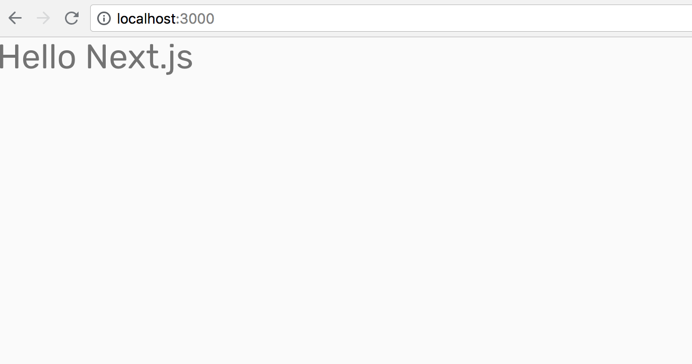
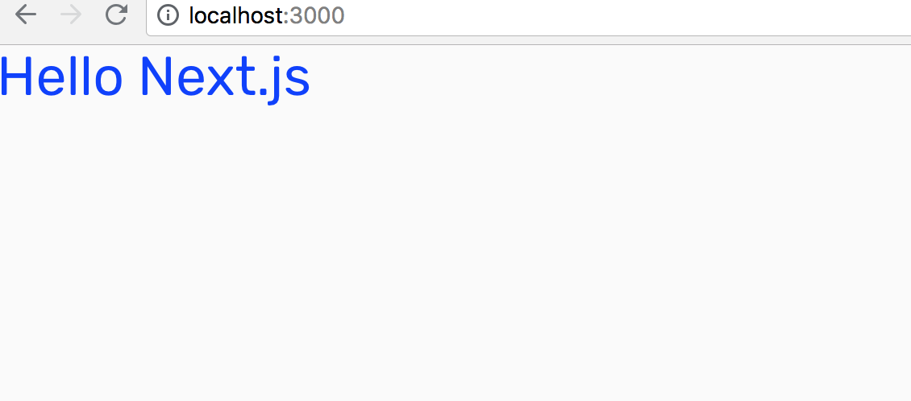

# Chap2 material-ui Setup

### 

### Install material-ui



```text
yarn add @material-ui/core
```

```text
yarn add @material-ui/icons
```

### Setup for nextjs

### pages/\_document.js



```javascript
import React from 'react';
import PropTypes from 'prop-types';
import Document, { Head, Main, NextScript } from 'next/document';
import flush from 'styled-jsx/server';

class MyDocument extends Document {
  render() {
    const { pageContext } = this.props;

    return (
      <html lang="en" dir="ltr">
        <Head>
          <title>My page</title>
          <meta charSet="utf-8" />
          {/* Use minimum-scale=1 to enable GPU rasterization */}
          <meta
            name="viewport"
            content="minimum-scale=1, initial-scale=1, width=device-width, shrink-to-fit=no"
          />
          {/* PWA primary color */}
          <meta name="theme-color" content={pageContext.theme.palette.primary.main} />
          <link
            rel="stylesheet"
            href="https://fonts.googleapis.com/css?family=Roboto:300,400,500"
          />
        </Head>
        <body>
          <Main />
          <NextScript />
        </body>
      </html>
    );
  }
}

MyDocument.getInitialProps = ctx => {
  // Resolution order
  //
  // On the server:
  // 1. app.getInitialProps
  // 2. page.getInitialProps
  // 3. document.getInitialProps
  // 4. app.render
  // 5. page.render
  // 6. document.render
  //
  // On the server with error:
  // 1. document.getInitialProps
  // 2. app.render
  // 3. page.render
  // 4. document.render
  //
  // On the client
  // 1. app.getInitialProps
  // 2. page.getInitialProps
  // 3. app.render
  // 4. page.render

  // Render app and page and get the context of the page with collected side effects.
  let pageContext;
  const page = ctx.renderPage(Component => {
    const WrappedComponent = props => {
      pageContext = props.pageContext;
      return <Component {...props} />;
    };

    WrappedComponent.propTypes = {
      pageContext: PropTypes.object.isRequired,
    };

    return WrappedComponent;
  });

  return {
    ...page,
    pageContext,
    // Styles fragment is rendered after the app and page rendering finish.
    styles: (
      <React.Fragment>
        <style
          id="jss-server-side"
          // eslint-disable-next-line react/no-danger
          dangerouslySetInnerHTML={{ __html: pageContext.sheetsRegistry.toString() }}
        />
        {flush() || null}
      </React.Fragment>
    ),
  };
};

export default MyDocument;
```




### pages/\_app.js

Note that I changed folder `src` to `utils`

from

```text
import getPageContext from '../src/getPageContext';
```

to

```text
import getPageContext from '../utils/getPageContext';
```




```javascript
import React from 'react';
import App, { Container } from 'next/app';
import { MuiThemeProvider } from '@material-ui/core/styles';
import CssBaseline from '@material-ui/core/CssBaseline';
import JssProvider from 'react-jss/lib/JssProvider';
import getPageContext from '../utils/getPageContext';

class MyApp extends App {
  constructor(props) {
    super(props);
    this.pageContext = getPageContext();
  }

  pageContext = null;

  componentDidMount() {
    // Remove the server-side injected CSS.
    const jssStyles = document.querySelector('#jss-server-side');
    if (jssStyles && jssStyles.parentNode) {
      jssStyles.parentNode.removeChild(jssStyles);
    }
  }

  render() {
    const { Component, pageProps } = this.props;
    return (
      <Container>
        {/* Wrap every page in Jss and Theme providers */}
        <JssProvider
          registry={this.pageContext.sheetsRegistry}
          generateClassName={this.pageContext.generateClassName}
        >
          {/* MuiThemeProvider makes the theme available down the React
              tree thanks to React context. */}
          <MuiThemeProvider
            theme={this.pageContext.theme}
            sheetsManager={this.pageContext.sheetsManager}
          >
            {/* CssBaseline kickstart an elegant, consistent, and simple baseline to build upon. */}
            <CssBaseline />
            {/* Pass pageContext to the _document though the renderPage enhancer
                to render collected styles on server side. */}
            <Component pageContext={this.pageContext} {...pageProps} />
          </MuiThemeProvider>
        </JssProvider>
      </Container>
    );
  }
}

export default MyApp;
```




### utils/getPageContext.js



```javascript
/* eslint-disable no-underscore-dangle */

import { SheetsRegistry } from 'jss';
import { createMuiTheme, createGenerateClassName } from '@material-ui/core/styles';
import purple from '@material-ui/core/colors/purple';
import green from '@material-ui/core/colors/green';

// A theme with custom primary and secondary color.
// It's optional.
const theme = createMuiTheme({
  palette: {
    primary: {
      light: purple[300],
      main: purple[500],
      dark: purple[700],
    },
    secondary: {
      light: green[300],
      main: green[500],
      dark: green[700],
    },
  },
});

function createPageContext() {
  return {
    theme,
    // This is needed in order to deduplicate the injection of CSS in the page.
    sheetsManager: new Map(),
    // This is needed in order to inject the critical CSS.
    sheetsRegistry: new SheetsRegistry(),
    // The standard class name generator.
    generateClassName: createGenerateClassName(),
  };
}

export default function getPageContext() {
  // Make sure to create a new context for every server-side request so that data
  // isn't shared between connections (which would be bad).
  if (!process.browser) {
    return createPageContext();
  }

  // Reuse context on the client-side.
  if (!global.__INIT_MATERIAL_UI__) {
    global.__INIT_MATERIAL_UI__ = createPageContext();
  }

  return global.__INIT_MATERIAL_UI__;
}
```




### Change Font








```javascript
...
  <Head>
    <title>My page</title>
    <meta charSet="utf-8" />
    {/* Use minimum-scale=1 to enable GPU rasterization */}
    <meta
      name="viewport"
      content="minimum-scale=1, initial-scale=1, width=device-width, shrink-to-fit=no"
    />
    {/* PWA primary color */}
    <meta name="theme-color" content={pageContext.theme.palette.primary.main} />
    <link href="https://fonts.googleapis.com/css?family=Rubik" rel="stylesheet" />
  </Head>
...
```






```javascript
const theme = createMuiTheme({
  typography: {
    fontFamily:
      '"Rubik", sans-serif',
  },
  palette: {
    primary: {
      light: purple[300],
      main: purple[500],
      dark: purple[700],
    },
    secondary: {
      light: green[300],
      main: green[500],
      dark: green[700],
    },
  },
});
```






```javascript
import Typography from '@material-ui/core/Typography';

const Index = () => (
  <div>
    <Typography variant="display1" gutterBottom>Hello Next.js</Typography>
  </div>
)

export default Index
```







### Change Color

[https://material-ui.com/style/color/](https://material-ui.com/style/color/)



```javascript
/* eslint-disable no-underscore-dangle */

import { SheetsRegistry } from 'jss';
import { createMuiTheme, createGenerateClassName } from '@material-ui/core/styles';

// A theme with custom primary and secondary color.
// It's optional.
const theme = createMuiTheme({
  typography: {
    fontFamily:
      '"Rubik", sans-serif',
  },
  palette: {
    primary: {
      light: '#355eff',
      main: '#0336ff',
      dark: '#0225b2',
    },
    secondary: {
      light: '#ffe435',
      main: '#ffde03',
      dark: '#b29b02',
    },
  },
});

function createPageContext() {
  return {
    theme,
    // This is needed in order to deduplicate the injection of CSS in the page.
    sheetsManager: new Map(),
    // This is needed in order to inject the critical CSS.
    sheetsRegistry: new SheetsRegistry(),
    // The standard class name generator.
    generateClassName: createGenerateClassName(),
  };
}

export default function getPageContext() {
  // Make sure to create a new context for every server-side request so that data
  // isn't shared between connections (which would be bad).
  if (!process.browser) {
    return createPageContext();
  }

  // Reuse context on the client-side.
  if (!global.__INIT_MATERIAL_UI__) {
    global.__INIT_MATERIAL_UI__ = createPageContext();
  }

  return global.__INIT_MATERIAL_UI__;
}
```






```javascript
import Typography from '@material-ui/core/Typography';

const Index = () => (
  <div>
    <Typography variant="display1" color="primary" gutterBottom>Hello Next.js</Typography>
  </div>
)

export default Index
```







